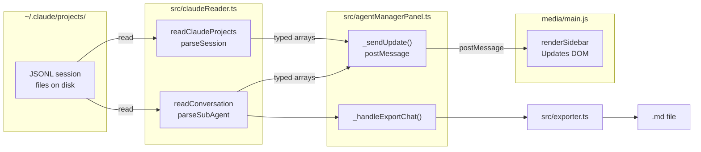

# Architecture

## Overview

Claude Agent Manager is a VSCode extension that reads Claude Code session data from `~/.claude/projects/` and displays it in a two-panel webview: a sidebar for browsing sessions and a main panel for viewing conversations. It is read-only — it never writes to Claude's data files.

## Data Flow

## Extension Lifecycle

1. **Activation**: `onStartupFinished` — registers the `claudeAgentManager.openPanel` command.
2. **Panel creation**: `AgentManagerPanel.createOrShow()` — singleton pattern, creates webview with CSP, loads `media/marked.min.js`, `media/main.js`, and `media/style.css`.
3. **Data refresh**: Every 30 seconds (when visible) + on-demand via refresh button. Reads all JSONL files, posts to webview.
4. **Conversation loading**: On session/agent click in sidebar, `readConversation()` parses the full JSONL into `ConversationMessage[]` and posts to the webview.
5. **Live tailing**: `_setupFileWatcher()` watches the open JSONL file with `fs.watch`. On change, re-reads and posts `conversationTail` with the full updated message list. The webview diffs against `renderedMessageCount` and appends only new messages.
6. **Export**: `_handleExportChat()` delegates to `exportConversation()` in `src/exporter.ts`, which writes Markdown files to disk.
7. **Deactivation**: Panel disposed, timer and file watcher cleared.

## Key Design Decisions

- **Synchronous file reads** in `claudeReader.ts` — acceptable because session files are small and reads are infrequent (30s interval).
- **No external runtime dependencies** — only `typescript` and `@types/*` as devDependencies. No bundler. `marked.min.js` is vendored into `media/`.
- **CSP-secured webview** — nonce-based script loading, no inline scripts.
- **Two-panel layout** — sidebar (project/session tree) + main conversation panel. Collapses to icon rail + overlay in narrow mode (< 600px).
- **State persistence** — webview uses `vscode.getState()`/`setState()` for filter/search state. Extension uses `globalState` for pinned projects and settings (sound, export destination/format).
- **File watcher pause/resume** — watcher is paused when the webview is hidden and resumed on visibility to avoid stale updates.
